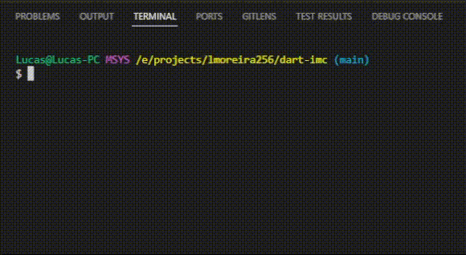

# Dart IMC

Projeto implementado com o intuito de aprender dart na Formação Flutter Specialist da plataforma DIO.

## Demonstração

## Como executar

Para executar o projeto primeiro é necessário clonar o projeto rodando o seguinte comando:

`git clone https://github.com/lmoreira256/dart-imc.git`

E então com o SDK do Dart ou Flutter (que já acompanha o SDK do Dart) instalado basta rodar o seguinte comando:

`dart run`